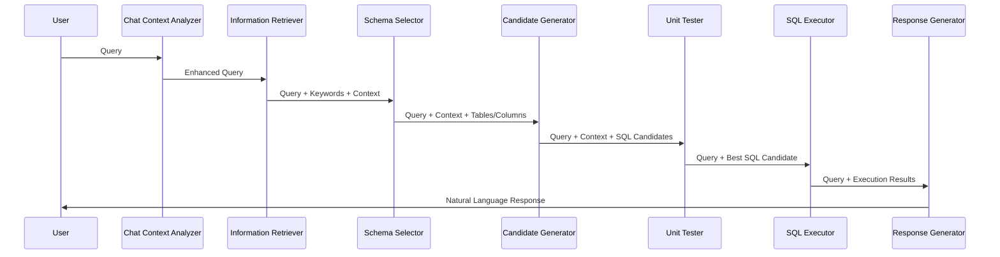

# Component Interaction in CHESS+

## State-Based Communication

CHESS+ agents communicate via a shared system state that evolves as it passes through the pipeline. This approach:

- Maintains a single source of truth throughout execution
- Allows each agent to access all previously generated information
- Provides a structured way to track progress and debug issues
- Enables stateful interactions across multiple user turns in chat mode

## SystemState Structure

The `SystemState` class contains:

- **query**: The original user query
- **enhanced_query**: The processed and enhanced query
- **chat_history**: Previous interactions for context
- **table_info**: Database schema information
- **keywords**: Extracted keywords from the query
- **entities**: Named entities found in the query
- **retrieved_context**: Relevant context from knowledge sources
- **selected_tables**: Tables identified as relevant to the query
- **selected_columns**: Columns identified as relevant to the query
- **candidate_queries**: Generated SQL queries
- **candidate_feedback**: Evaluation feedback on SQL queries
- **execution_results**: Results from executing SQL queries
- **formatted_response**: The final natural language response

## Agent Interaction Flow



## Tool Composition

Each agent is composed of specialized tools:

1. **ChatContextAnalyzer**
   - HistoryAnalyzer: Examines past interactions
   - QueryEnhancement: Improves query clarity and specificity

2. **InformationRetriever**
   - ExtractKeywords: Identifies key terms in the query
   - RetrieveContext: Finds relevant documentation
   - RetrieveEntity: Identifies named entities

3. **SchemaSelector**
   - SelectTables: Identifies relevant database tables
   - SelectColumns: Identifies relevant columns
   - FilterColumn: Prunes irrelevant columns

4. **CandidateGenerator**
   - GenerateCandidate: Creates SQL query options
   - Revise: Refines queries based on feedback

5. **UnitTester**
   - GenerateUnitTest: Creates tests for SQL queries
   - Evaluate: Assesses query correctness and performance

6. **SQLExecutor**
   - Executes SQL and handles database errors

7. **ResponseGenerator**
   - ResponseFormatter: Structures the response
   - Supports multiple response types (text, table, chart)

## Error Handling and Fallbacks

CHESS+ implements robust error handling:

1. **LLM Errors**: Automatic retries with exponential backoff
2. **Parsing Failures**: Graceful degradation with alternative parsing strategies
3. **SQL Execution Errors**: Error interpretation and suggestions for correction
4. **Pipeline Node Failures**: Skip or substitute alternative nodes
5. **Database Connection Issues**: Automatic reconnection attempts

## Configuration Interaction

YAML configuration files control how components interact:

```yaml
pipeline_nodes:
  - keyword_extraction
  - entity_retrieval
  - context_retrieval
  - column_filtering
  - table_selection
  - column_selection
  - candidate_generation
  - revision
  - evaluation
```

This configuration defines which agents are active and their execution order, allowing for flexible pipeline customization without code changes.