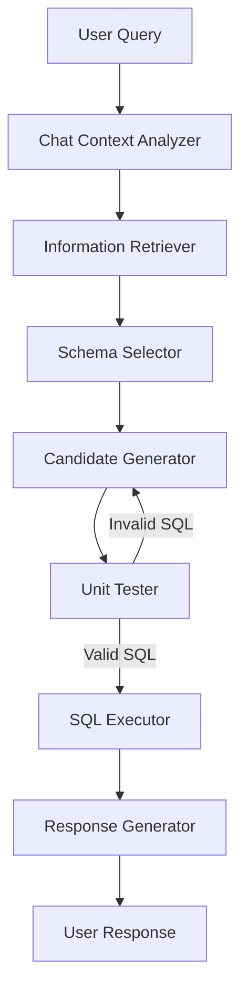

# CHESS+ Pipeline Workflow

## Overview

The CHESS+ pipeline is a configurable sequence of processing nodes that transform a natural language query into SQL and a natural language response. The pipeline is implemented using LangGraph's StateGraph, creating a directed graph of agent nodes with state transitions.

## Pipeline Architecture

The pipeline follows a directed acyclic graph (DAG) structure with sequential and conditional processing:



## Pipeline Nodes

The pipeline can include the following nodes, which can be enabled or disabled in the configuration:

1. **Chat Context Analyzer**
   - Input: Raw user query, chat history
   - Process: Analyzes context, enhances query clarity
   - Output: Enhanced query with context understanding
   - Configuration: `chat_context_analyzer`

2. **Information Retriever**
   - Input: Enhanced query
   - Process: Extracts keywords, retrieves context and entities
   - Output: Keywords, entities, and contextual information
   - Configuration: `keyword_extraction`, `entity_retrieval`, `context_retrieval`

3. **Schema Selector**
   - Input: Query, keywords, entities
   - Process: Selects relevant tables and columns from schema
   - Output: Pruned schema with relevant tables and columns
   - Configuration: `column_filtering`, `table_selection`, `column_selection`

4. **Candidate Generator**
   - Input: Query, keywords, pruned schema, context
   - Process: Generates SQL query candidates
   - Output: List of SQL query candidates
   - Configuration: `candidate_generation`

5. **Unit Tester**
   - Input: SQL candidates
   - Process: Evaluates SQL for correctness and performance
   - Output: Validated SQL with quality metrics
   - Configuration: `evaluation`

6. **SQL Executor**
   - Input: Best SQL candidate
   - Process: Executes SQL against the database
   - Output: Query results or error information
   - Configuration: `execution`

7. **Response Generator**
   - Input: Query results, original query
   - Process: Formats response in natural language
   - Output: Human-readable response with results
   - Configuration: `response_generation`

## Pipeline Configuration

The pipeline is configured through YAML files in the `run/configs/` directory:

```yaml
pipeline_nodes:
  - keyword_extraction
  - entity_retrieval
  - context_retrieval
  - column_filtering
  - table_selection
  - column_selection
  - candidate_generation
  - revision
  - evaluation
  - execution
  - response_generation

chat_history:
  enabled: true
  max_turns: 10

llm:
  provider: "openai"
  model: "gpt-4"
  temperature: 0.2
```

## State Management

The pipeline uses a `SystemState` object that evolves as it passes through nodes:

```python
from workflow.system_state import SystemState

# Initial state
state = SystemState(
    query="Find all employees in the marketing department",
    chat_history=[],
    table_info={"employees": [...], "departments": [...]}
)

# After Information Retriever
state.keywords = ["employees", "marketing", "department"]
state.entities = [{"entity": "marketing", "type": "department"}]

# After Schema Selector
state.selected_tables = ["employees", "departments"]
state.selected_columns = {"employees": ["id", "name", "dept_id"], 
                          "departments": ["id", "name"]}

# After Candidate Generator
state.candidate_queries = [
    "SELECT e.id, e.name FROM employees e JOIN departments d ON e.dept_id = d.id WHERE d.name = 'Marketing'"
]

# After SQL Executor
state.execution_results = [
    {"id": 1, "name": "John Smith"},
    {"id": 5, "name": "Jane Doe"}
]

# Final state
state.formatted_response = "I found 2 employees in the Marketing department: John Smith and Jane Doe."
```

## Team Builder

The `TeamBuilder` class is responsible for constructing the pipeline:

```python
from workflow.team_builder import TeamBuilder

# Configure the pipeline
team_builder = TeamBuilder(config)

# Build the agent pipeline
graph = team_builder.build_team()

# Run the pipeline
result = graph.invoke({"query": "Find employees in marketing"})
```

## Execution Modes

CHESS+ supports multiple execution modes:

1. **Batch Mode**: Process a dataset of queries
   ```bash
   python src/main.py --data_mode batch --data_path ./data/test.json
   ```

2. **Interactive Mode**: Chat interface for direct interaction
   ```bash
   python interface.py --mode chat
   ```

3. **API Mode**: Run as a service with REST API endpoints
   ```bash
   python backend.py
   ```

## Pipeline Extensibility

The pipeline can be extended by:

1. **Adding New Agents**: Create a new agent class in `src/workflow/agents/`
2. **Creating New Tools**: Add tools in the agent's `tool_kit/` directory
3. **Configuring the Pipeline**: Update YAML config to include the new agent

## Parallel Processing

The pipeline supports parallel processing:

1. **Batch Parallelism**: Process multiple queries simultaneously
2. **Node Parallelism**: Run independent nodes in parallel
3. **Tool Parallelism**: Execute multiple tools concurrently

Configure parallelism in the config file:

```yaml
parallelism:
  batch_size: 10
  max_workers: 4
  timeout: 60
```

## Error Recovery

The pipeline includes error recovery mechanisms:

1. **Retry Logic**: Failed nodes can be retried with different parameters
2. **Fallback Paths**: Alternative processing routes if primary fails
3. **Graceful Degradation**: Continue with partial results if full processing fails

## Monitoring and Logging

The pipeline generates detailed logs and metrics:

1. **Performance Metrics**: Timing information for each node
2. **Intermediate States**: Snapshots of state at each pipeline stage
3. **Error Reports**: Detailed information about failures
4. **Quality Metrics**: Evaluation of SQL correctness and response quality

Logs are stored in the `logs/` directory with structured output for analysis.